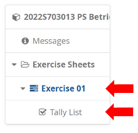

# Exercise Sheet 1

This exercise sheet contains the self-assessment exercise along with some introductory exercises to using the command-line.

## Task 1

This first task does not require the use of any operating systems concepts besides what you have already learned in the previous semester.
Instead, the purpose of this task is to check (for yourself) whether you are sufficiently fluent in using the C programming language.
Most exercises in this course will build directly on top of what you've learned in the previous semester.
If you are struggling with this task, consider doing this course a year later, familiarizing yourself with the C Programming language in the meantime.
The workload might otherwise be higher for you than originally planned by us.

The task description is found in [`game_of_life/`](game_of_life/).

## Task 2

As a computer scientist you will likely spend a lot of your time in a terminal.
It is therefore a good idea to get accustomed to a few basic commands.
We will gradually introduce new commands and concepts over the semester.

For now you should teach yourself how to do the following tasks.
Introductory [slides from the previous year](../lab01/history_and_shell.pdf) are provided, but you are free to use any tutorial you find.

- Connecting to ZID-GPL via `ssh`
  - See [LPCCS System](https://www.uibk.ac.at/zid/systeme/linux/)
  - If the `ssh` command is not available on your system, install the *OpenSSH Client*
    - Windows: Settings > Apps & features > Optional features > OpenSSH Client
    - Ubuntu: `sudo apt install openssh-client` in your terminal
  - You can close the connection by logging out with the `exit` command

- Looking around, changing directory (`pwd`, `ls`, `cd`)
- Creating files and directories (`touch`, `mkdir`)
- Copying, moving, deleting files and directories (`cp`, `mv`, `rm`)
- Using a terminal text editor (`nano`)
  - `^X` means pressing `CTRL + x`
- Getting help
  - `man` to view the manual (man) page of a command
  - `help` to get information on shell built-ins (e.g. `help cd`).
    Try this if there is no man page available.
  - `info` to view the info page of a command.
    This can sometimes give you more information than the man page.
  - `apropos` to search for man pages
  - Appending `--help` to a command (e.g. `ls --help`)

Next, read the following man pages to get a better understanding of your surroundings:

- Read `man intro`
- Skim over `man man-pages`, take note of the sections
- Skim over `man file-hierarchy`
- Figure out the difference between `man printf` and `man 3 printf`

Finally, put together a summary of all the commands and man pages mentioned above.

- Write the summary on ZID-GPL using `nano`
- Figure out a way to copy files from ZID-GPL to your local system

## Task 3

The program [`list_args.c`](list_args/list_args.c) prints its commandline arguments when run, one per line.
How do you run the program to produce the following output:

```
0: ./list_args
1: one
2: two words
3: "quotes"
4: 'more' "quotes"
```

- - -

Submit your solution as a zip archive via [OLAT](https://lms.uibk.ac.at), structured as followes, where `csXXXXXX` is your UIBK login name.
Your zip archive **must not** contain binaries.

```
exc01_csXXXXXX.zip
├── game_of_life/
│   ├── Makefile         # optional
│   └── game.c
├── task_2_summary.txt
└── task_3_command.txt
```

**Do not forget to mark the exercises solved after uploading your solution!**


