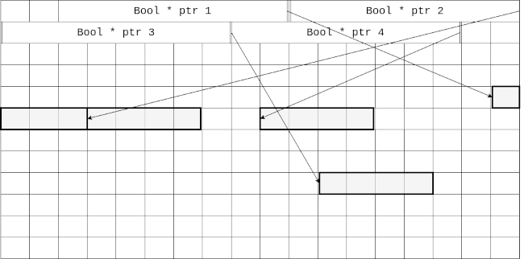

# Exercise 1 - Feedback

## General

### Read the documentation of the functions you are using

We have seen a few instances where students would use `sprintf` only for converting an integer to a string.
The resulting string was then concatenated with other strings to build the filenames for the Game of Life exercise.

This can be achieved with `sprintf` directly:

```c
char filename[32];
snprintf(filename, sizeof(filename), "gol_%05d.pbm", step);
```

### Do not re-implement standard library functions

Know about basic functions provided by the standard library.
Read their documentation and use them instead of implementing the functionality yourself.

Don't build your own `int length(char* sz)` that counts the characters until `\0`, use `strlen`.

### Check your solution using `valgrind`

`valgrind` can show you errors that occur at runtime.
This includes usage of uninitialized values and accessing (reading/writing) invalid memory locations.
Additionally it will inform you about memory leaks.

There is no 100% guarantee that your program is correct just because `valgrind` did not find any errors.
Yet, it's still a tool you should use regularly — especially before submitting your solution.
There could be false positives, but they occur rarely.

Adding `-g` (debug symbols) to your compile flags enabled `valgrind` to report source code line numbers when encountering an error.

If you cannot figure out why a certain error is reported, ask in the tutorium Discord channels for help.

### Do not add extra functionality

Some students have added additional functionality to their program that was not requested by the assignment.
For instance: removing all `.pbm` files at start, or invoking `convert` after simulation.

While this can be handy during development, and might be a worthwhile learning experience, please remove these features before submitting your solution.
This behavior can cause errors with our review process and are a potential source of error.
Keep it simple.

This also covers (debug) output of your program.
Please, disable all print statements that do not correspond to the assignment.

### Auto-format your code

Code should always be consistently formatted.

We recommend using a tool that automatically formats your code (e.g. `clang-format`).
Many IDEs / text editors can invoke these tools via a keyboard shortcut, or automatically on save.
For [VSCode](https://code.visualstudio.com/), the standard [C/C++ extension](https://marketplace.visualstudio.com/items?itemName=ms-vscode.cpptools) can do this.

### Use functions

Functions are the most important building block we have to structure code.
They allow us to group code together and reuse it.
Even if you use the function only once, there are still benefits.

In addition to a descriptive name, a function should also have a meaningful signature (parameter list and return type) that explains what the function is doing.
It's also way easier to understand a function call `count_neighbors(field, x, y)` than a block of 20 lines of code with inexpressive variable names.
This often removes the need for a comment as the function name (and arguments) tell you what is happening.

Picking good names for functions — or variables, or anything else really — is one of the hardest problems in coding.
Practice makes perfect; so spend a lot of time coming up with accurate, expressive names.

### Comments

Writing good, helpful comments requires a lot of experience and cannot be explained in a few short sentences.
We will probably investigate this topic in more depth later during the semester.
For now consider these guidelines:

1.  A comment should tell you the **why**, not the **what** or **how**.

    There is a mythical concept called _self-documenting_ code, but we won't explore that rabbit hole right now.
    Let's just say, we (including you and your fellow students) are programmers.
    We can read code.
    Your first priority should be to make the actual code as expressive as possible by picking good names and following idiomatic (i.e. conventional) patterns, like using a for-loop to iterate over an array.

    Another way is to ask yourself: does that comment add new information?
    If the comment can be replicated solely by reading the lines it comments on, there is hardly any value to it and you might be better off removing it.

    In this example, the comment does not add any new information.
    The variable named `sum` and the conventional for-loop already tell the **what** and **how**.

    ```c
    // sum up elements of myArray           ← unnecessary
    int sum = 0;
    for (int i = 0; i < myArraySize; ++i) {
        sum += myArray[i];
    }
    ```

    When code gets more complicated, introduce a function and pick expressive names.

    ```c
    int sumOfPositives = sumUpPositiveValues(myArray, myArraySize);
    ```

2.  Write full, English sentences including proper capitalization and punctuation.
    Like with variable / function names, avoid abbreviations or introducing new names for already established concepts.

3.  A comment should precede the code it comments on.

As already mentioned, writing good comments is an art that requires a lot of experience.
Naturally there exists a lot of literature regarding this topic.
There will be more about it later, for now you could take a look at this [Stack Overflow blog post](https://stackoverflow.blog/2021/12/23/best-practices-for-writing-code-comments/).

## Game of Life

### Variable types

We observed that many solutions used `int` as element type for the game field array.
While this is possible, `bool` is more appropriate here as there are only two valid values.
A cell can be either _alive_ (`true`) or _dead_ (`false`).

If you want to improve expressivity you could introduce a dedicated type:

```c
enum CellState {
    CELL_STATE_ALIVE,
    CELL_STATE_DEAD,
};
```

_Note:_ Booleans will (most likely) have a smaller allocation size than `int` or an enum type.

### Use of multi-dimensional arrays

The following code initializes a game field as nested arrays.
This results in memory allocations similar to a linked-list as shown in Figure 1.

```c
bool** field = malloc(height * sizeof(bool*));
for (int y = 0; y < height; ++i) {
    field[y] = malloc(width * sizeof(bool));
}
```

\
Figure 1: 2D array allocation example

The benefit of the nested (2D) array is that elements are accessed with two indices (e.g. `field[y][x]`), mimicking 2 dimensional coordinates.
However, the drawbacks are more complex allocation/de-allocation logic and worse performance.
Note that bounds checking is required for both dimensions.

We recommend using a single (linear) array instead.
Figure 2 shows the corresponding memory allocation for such a linear array.
Apart from better performance, this also removes the need for complex allocation/de-allocation logic.

```c
bool* field = malloc(width * height * sizeof(bool));
```

\
Figure 2: Linear array allocation example

We can still access the array with 2 dimensional coordinates:

1.  Simply use `field[y * width + x]`.
    While we could define a macro for this expression, there isn't really a benefit to that.

2.  Use an object oriented approach, creating a dedicated type for the field, storing the width and height with the data.
    Add `getCell` (and `setCell`) functions.

    ```c
    struct Field {
        int width;
        int height;
        bool* data;
    };

    bool getCell(const struct Field* field, int x, int y) {
        return field->data[y * field->width + x];
    }
    ```

    This improves the call-site in a way that we don't have to explicitly carry around the `width`.
    Bounds checking can also be added to these get/set functions.

3.  Use a [variable-length array (VLA)](https://en.wikipedia.org/wiki/Variable-length_array) type:

    ```c
    bool(*field)[width] = malloc(width * height * sizeof(bool));
    field[y][x] = true;
    ```
