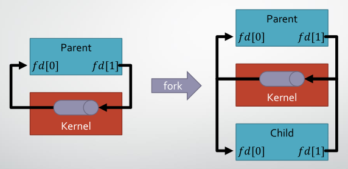
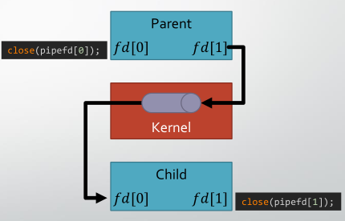
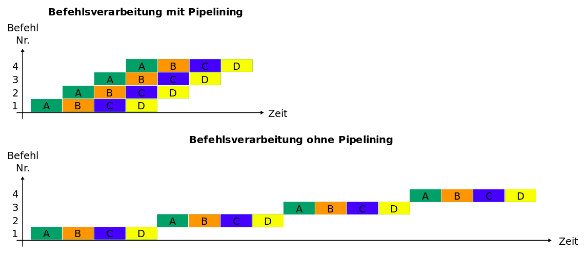

# Feedback — Exercise Sheet 4

## General

### Provided material is not always correct/complete

In response to recent discussions we'd like to point out that _all_¹ material provided may be incorrect and/or incomplete.
For instance, code shown during the lecture may omit proper error handling and other best-practices to focus on what needs to be explained — or to make the code fit onto a single slide.
Copying code verbatim is not advised.

You are solely responsible for your submission.
Arguing that, e.g. your solution does not have proper error handling because it was not part of the lecture's code, is not acceptable.

¹Not limited to material provided by us.
Man pages, books, StackOverflow posts, etc. can contain errors as well.

### Keep it simple

Some students had problems with parsing expressions in the _math server_.
The assignment specifies the format of expressions and establishes that input not conforming to this format is malformed.
A simple format string can be used to parse the given format.
No need for creating a full lexer/parser.

```c
float operand1, operand2;
char operation;
scanf("%f %c %f", &operand1, &operation, &operand2);
```

Initialization and error handling omitted for brevity.

### Encountering strange behavior

Students sometimes observe strange behavior while developing their solution.
If you encounter such behavior, put together a minium example that reproduces the issue.
Also include step-by-step instructions.

Trying to reconstruct the exact same code days later from memory typically does not work.

### Fixed sized buffers are often sufficient

The following code tries to create a buffer (`filepath`) with _exactly_ the size needed.

```c
char filepath[strlen(getlogin()) + strlen(argv[1]) + 7];
sprintf(filepath, "/tmp/%s_%s", getlogin(), argv[1]);
```

Ignoring for a second that `getlogin` is assumed to return a valid pointer — which it does not in WSL — this code is unnecessarily complex.
It might be a better approach to pick a reasonably sized buffer and error out if this buffer is exhausted.
Either way, it is recommended to impose an upper bound on the size of stack allocated buffers to prevent a stack overflow.
Practically, if a reasonably sized buffer is exhausted, there is likely an error in the application.

The following code does this, including error handling.
Here we assume that 128 characters are enough for the path we are building.

```c
const char* username = getlogin();
if (!username) {
    perror("getlogin");
    exit(EXIT_FAILURE);
}

char filepath[128] = {0};
int n = snprintf(filepath, sizeof(filepath), "/tmp/%s_%s", username, argv[1]);
if (n < 0) {
    perror("snprintf");
    exit(EXIT_FAILURE);
} else if ((size_t)n >= sizeof(filepath)) {
    fprintf(stderr, "Buffer exhausted\n");
    exit(EXIT_FAILURE);
}
```

Alternatively, you can use `asprintf` to create a heap-allocated string.

```c
char* filepath = NULL;
int n = asprintf(&filepath, "/tmp/%s_%s", username, argv[1]);
if (n == -1) {
    fprintf(stderr, "Could not allocate filepath\n");
    exit(EXIT_FAILURE);
}

// ...

free(filepath);
```

If this is not possible since `asprintf` is not available to you, you can still use `snprintf` to first tell you how big the buffer needs to be, then allocate it, then fill it.

```c
const char fmt[] = "/tmp/%s_%s";

int filepathSize = snprintf(NULL, 0, fmt, username, argv[1]) + 1;
char* filepath = malloc(filepathSize);
snprintf(filepath, filepathSize, fmt, username, argv[1]);

// ...

free(filepath);
```

Please refrain from using `strcat`, `strcpy`, and alike.
Stick with `snprintf`!

### Communicate errors

Just terminating the program with an exit-code ≠ 0 does not tell you what kind of error occurred — or where.
Error reporting should at least include the operation which lead to the error.
Note that most standard library functions use `errno` for error reporting (see `errno(3)`).
This is considered the bare minimum:

```c
FILE* fooFile = fopen("foo.txt", "rb");
if (!fooFile) {
    perror("fopen");
    exit(EXIT_FAILURE);
}
```

This would be more helpful though:

```c
const char fooFilepath[] = "foo.txt";

FILE* fooFile = fopen(fooFilepath, "rb");
if (!fooFile) {
	fprintf(stderr, "Could not open %s: %s\n", fooFilepath, strerror(errno));
	exit(EXIT_FAILURE);
}
```

With this we at least know the operation (opening a file), the operand (which file), and the error that occurred.

### Watch out for the error case

Some students correctly understand that `exec` _replaces_ the current process with the given executable.
Code after the `exec` call is therefore never executed — assuming the `exec` call is successful.
On failure, execution continues and proper error handling should be done.

## Working with anonymous pipes

### Closing unused/duplicate file descriptors

As shown by the lecture, after creating an anonymous pipe and forking, the child process inherits (a copy) of the parent's file descriptors.



You are then supposed to close the file descriptors that are not needed.
The main purpose for this is to correctly support the _closing mechanism_.
If a process reads from a file (i.e. pipe in this case) the read will consume available data or block² until data is available, or the file is closed.
The end of a pipe remains open until all respective file descriptors are closed.

² unless it's a non-blocking read



Closing unused file descriptors also mitigates leaking file descriptors.

This becomes a bit more finicky when using `dup2`.
This excerpt from [a StackOverflow answer](https://stackoverflow.com/a/33884746) provides a bit more insight.

```c
close(fd[INPUT_END]);                    // [STDIN -> terminal_input, STDOUT -> terminal_output, fd[1] -> pipe_output]
dup2(fd[OUTPUT_END], STDIN_FILENO);      // [STDIN -> pipe_output, STDOUT -> terminal_output, fd[1] -> pipe_output]   
close(fd[OUTPUT_END]);                   // [STDIN -> pipe_output, STDOUT -> terminal_output]                         
execlp("wc", "wc", "-l", (char*) NULL);
```

### Do not serialize the pipeline

The benefit of using a _pipeline_ is that later parts in the pipeline can start their task as soon as input arrives, despite the parts at the front haven't finished (i.e. consumed all input).
This increases the _throughput_ tremendously.

If this concept seems foreign to you, revisit your computer architecture material; _pipelining_ should be explained there.



In the exercise sheet, we do exactly the same with text.
More specifically: do not wait for the first process to finish before starting the next process.

There is also a _correctness_ issue that can arise.
The anonymous pipe is buffered, meaning _some_ data can be stored within the pipe itself.
However, this buffer is of limited size and writes will block once the buffer is full.
The child process doing the writing will therefore not terminate.
In order to _drain_ the buffer, a reader is required.
